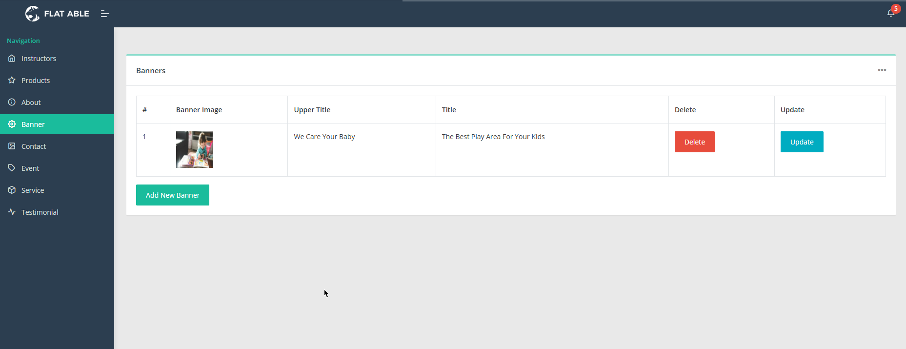

# MongoDb Baby Care Project

With this project i learned how to use MongoDb. In this project there is 2 side: Admin Panel and Main page. Admins can edit most of the website from admin panel.

## Technologies Used

The following technologies have been used in this project:

- **.NET Core**
- **.NET 8.0**
- **MongoDb**
- **Bootstrap**
- **AutoMapper**

## Screenshots

### Home Screens
| Homepage |
|--------------|
|  |

### Admin Screens

| About Page |
|--------------|
|  |

| Banner Page |
|--------------|
|  |

| Contact Page |
|-------------|
|  |

| Event Management |
|-----------------|
|  |

| Services Page |
|--------------|
|  |

| Products Page |
|--------------|
|  |

| Instructors Page |
|------------------|
|  |

| Update Instructors |
|---------------------|
|  |

| Testimonials Page |
|------------------|
| |